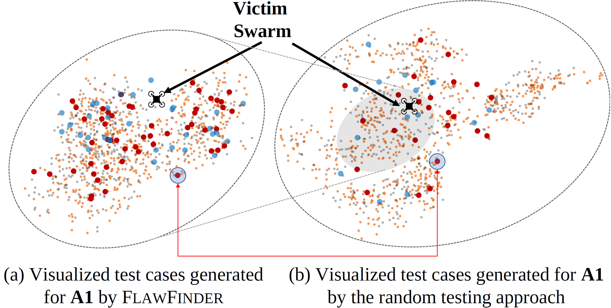

# Comparison to randomized sampling

The reviewer points out the instances that our approach overlooks (top of the gray circle). We manually analyzed them and confirmed that they are variants of what our approach already identified. We present an example of such a case (instances by random testing approach is a subset of instances by our technique) below. They have similar Dcc values, and our manual inspection result (with the screenshots) shows that they are the same class of bugs.

- For example, the pointed execution (the point in the circle) of (b) has the similar Dcc value with the pointed execution of (a).

  |            |                                  By SwarmFlawFinder (a)                                  |                             By a random testing (b)                              |
  | :--------: | :------------------------------------------------------------------------------: | :------------------------------------------------------------------------------: |
  | Screenshot |  |  |
  | Dcc value  |        |       |

  - From the Dcc value of the drone, we can see that an attacker approached the victim swarm at around 180 tick, and the progress is suspended (C1-5) after a while. The reason why there are perturbations after attack is due to C1-3.
  - NCC score between two executions: 6.1832 (very similar)

- Also, the corresponding executions for the remaining executions in (b) can be found in (a).
  | By SwarmFlawFinder (a) | By a random testing (b) |
  | :-----------------------------------------------------------------------: | :-----------------------------------------------------------------------: |
  |  |  |
  |  |  |
  |  |  |
  |  |  |
  |  |  |
