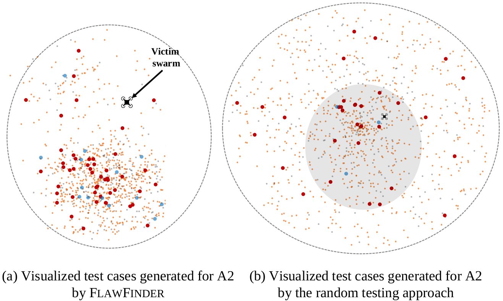
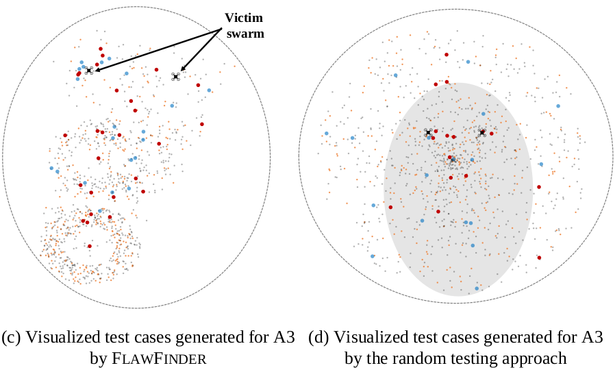

# Results from testing A2, A3 and A4 with FlawFinder and Random Testing
Figure below shows the results from the two versions for 24 hours of testing of A2, A3 and A4. Specifically, (a), (c) and (e) are the results from SwarmFlawFinder. 
(b), (d) and (f) are from the random testing version. The silver round circles approximately show the size of the tested area. Each dot in the figure represents a test case. Large dots indicate they result in new unique DCC values, where small dots are not. Red and orange dots are the test cases that caused mission failures (i.e., discovering logic flaws). Silver and blue dots are the test cases that do not cause mission failures. The shaded areas in (b), (d) and (f) represent the explored area by SwarmFlawFinder in (a), (c) and (e), respectively.

Observations. 

<!--  -->
<!-- -->

Observe that (a) has a particular pattern while (b) does not have such a pattern, and the test cases in (b) are more uniformly distributed. 
The pattern is indirectly revealing the characteristics of the swarm mission (e.g., where are the victim swarms heading). We can also observe that the upper half of the (e) is more crowded than other areas.
