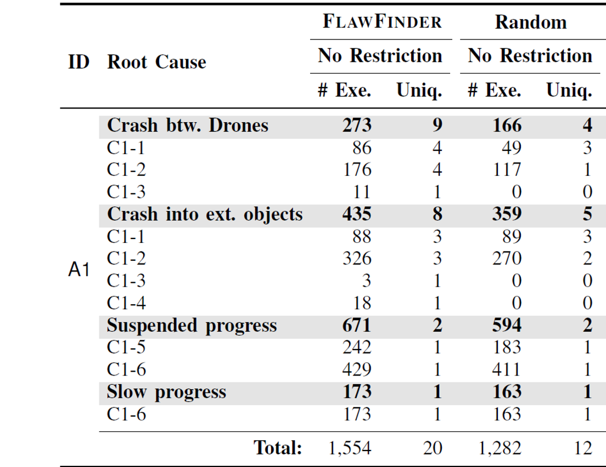

# Effectiveness of the naive testing

To answer whether a naive testing approach would be effective, we run a random testing approach with the same configurations we used in Table 3. Our approach identified 20 unique attacks for A1, whereas the randomized testing approach found 12 of them under the same configuration and settings.
This is because random testing misses rare cases that require dense spawn in particular areas (e.g., near the victim drones). The details are below.

