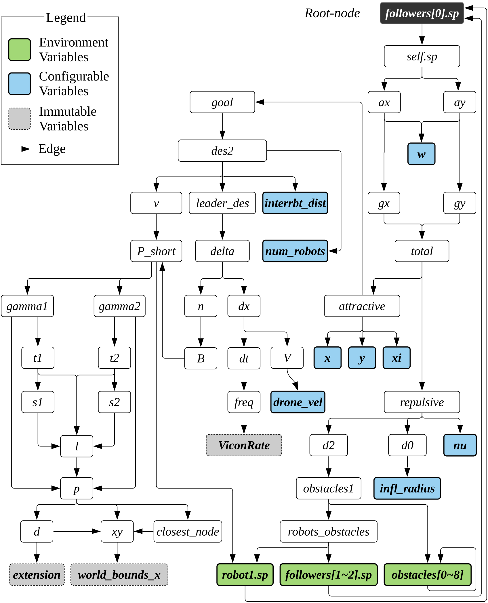

# Identifying configuration variables

This page presents detailed steps to identify configuration variables. These steps help to recognize the variables for world objects that is used in perturbation process.
Above figure shows the result of the static analysis on A1.

## 1. Identifying causal source variables.

As shown in the above figure, a swarm algorithm typically includes a number of variables. The above dependency graph is generated via the variable holding a coordinate of a drone, i.e., the drone’s decision. First we identify causal source variables. These are variables that are not derived by other variables and are causally related to the drones' decision in a swarm.

We identify the causal source variables as follows:
1. Using a standard static dependency analysis, build a static dependency graph as shown in the above figure with the root node as a variable that represents the drone’s coordinates ( `followers[0].sp` )
2. Identify the variable on the leaf nodes (the nodes with background colors). These are typically constants or a value from a configuration file (e.g., “variable = Constant or Config;”). 
3. Categorise the varaibles and identify as follows:

| Type | Description|
|------|------------|
|**Status (green):** | Variable that is derived twice (forms a cycle in a bi-directional graph). These variables' values keep changing during the execution reflecting the current status of the drone|
|**Configurable (blue):**|Variables that are configurable .i.e. values can be reassigned to a different value. They mostly have a simple pattern of “var = Constant-Value”.|
|**Immutable (gray):**|These are immutable variables .i.e. changinge their values would lead to an execution error (e.g., segmentation fault). These will be removed from our analysis|

> **NOTE:** Other variables that do not belong to the above three are simple derivatives of them (i.e., source variables). Status variables are a special kind of derivatives that is derived twice. In a swarm algorithm that is typically a closed-loop system, status variables often hold values from the previous loop (i.e., the previous tick), essentially representing the result of the last decision.

## 2. Identifying environment configuration variables.
Among the status variables, we focus on environment variables that represent objects such as obstacles or other robots. These are crucial since they represent every other thing in the environment that can impact the swarm. In order to identify these environment variables, we look for status variables with the same data type as the root node's variable (represents the robot's pose/coordinates).

From the above figure, we have all status variables (green nodes) as environment variables since they are of the same type as root node. Specifically, their data type is an array of a matrix of size three (`robot[3]`) and hold the coordinates (`x`, `y`, and `z`) on each index. In the above figure, there are three source variables for environment objects: `robot1.sp`, `followers[1-2].sp`, and `Obstacles[0-8]`.

