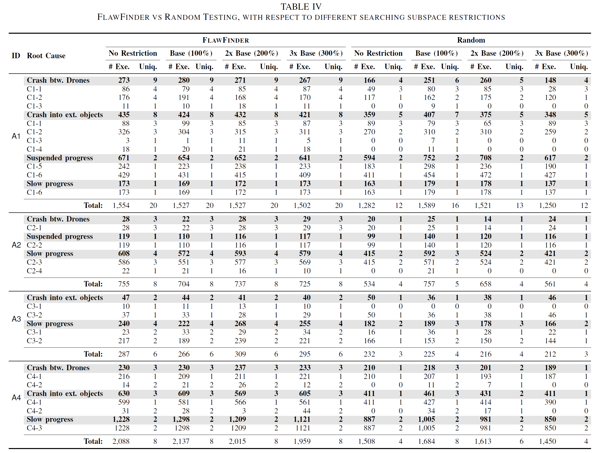
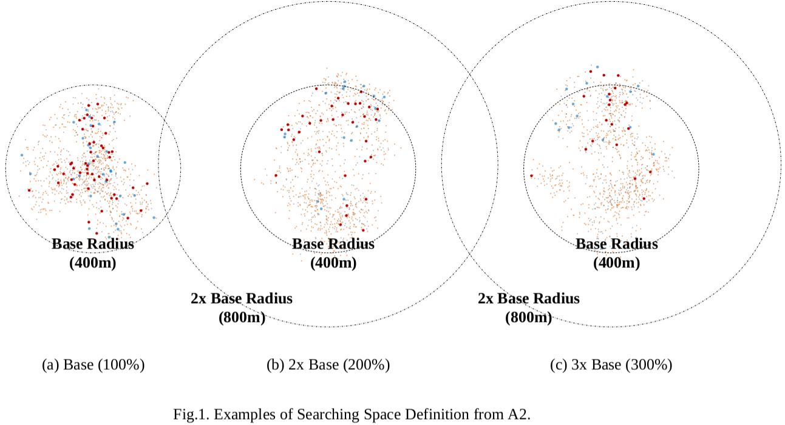
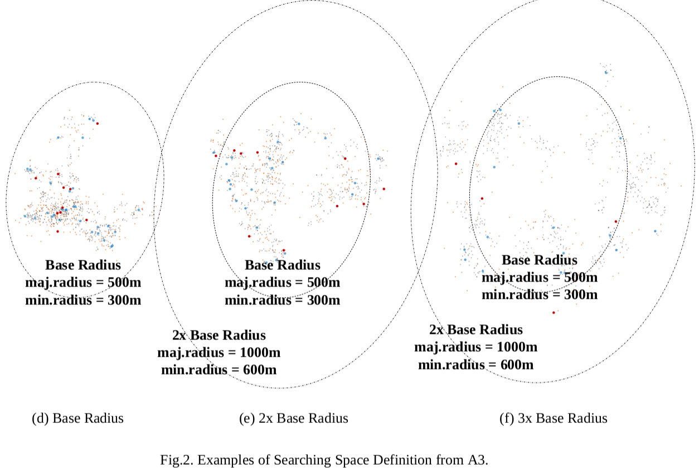

# SwarmFlawFinder vs Random Testing w.r.t 3 different searching subspace (Base, 2x Base, 3x Base)

Note that the base space area is the area what SwarmFlawFinder originally obtained natually.
Hence, applying searching space restrictions to SwarmFlawFinder does not make the results vary.
However, the random testing approach's performance varies significantly.

We define three different searching spaces for each algorithm. First, we run SwarmFlawFinder and obtain the explored space by SwarmFlawFinder as shown in (a), (d) and (g), considering it the baseline space. Second, from the baseline space, we define 2x and 3x Base by extending the radius of the baseline space by 2 and 3 times as shown in ((h), and (i)). 

Dots in the below figure represent executed test cases with the searching space restrictions. (A1's case is in the paper.) Note that it is not always distribution of points is larger than 2 times of searching space when 3 times of searching space is given (e.g., A2 and A3).

